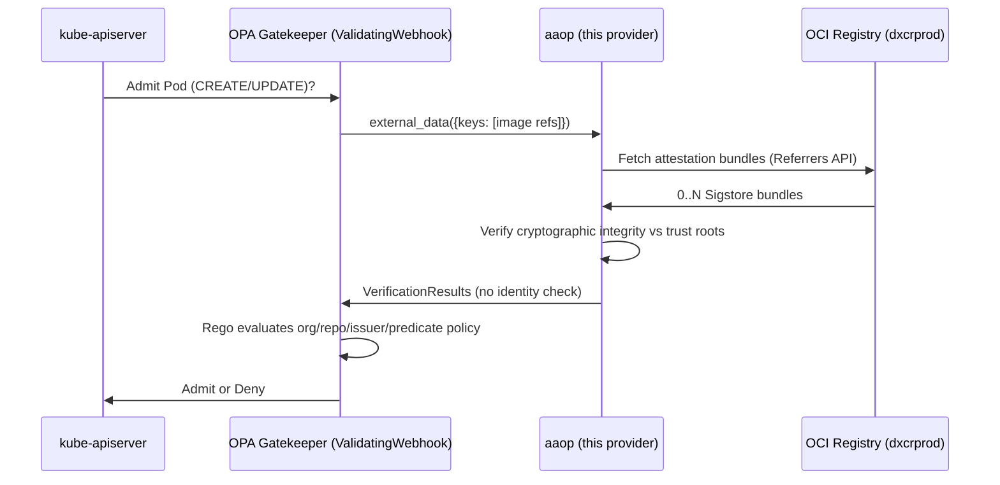

# Copilot instructions — artifact-attestations-opa-provider

Guidance for AI coding agents working in this repository. It combines a
standard project overview with the domain context needed to reason about
changes safely: how Kubernetes admission control works, how this service
integrates with OPA Gatekeeper, and how it is deployed inside GitHub.

## Overview

This repo is a Go implementation of an **OPA Gatekeeper external data
provider** (binary name `aaop`). During Kubernetes admission control it
verifies **GitHub Artifact Attestations** — [Sigstore
bundles](https://github.com/sigstore/architecture-docs/blob/main/client-spec.md)
containing signed SLSA build provenance — for the container images a Pod
wants to run.

The critical design invariant: **the provider verifies only cryptographic
integrity and authenticity against configured trust roots. It does NOT
verify identity (which org/repo/workflow signed the image).** Identity and
policy (allowed orgs, repos, issuers, predicate types) are evaluated by
Gatekeeper in Rego using the verification results the provider returns. Keep
this separation of concerns when editing `pkg/provider` or `pkg/verifier`.

> The project README carries an early-preview/experimental warning. Treat
> stability and API surface as still-evolving.

## Repository layout

| Path | Purpose |
| --- | --- |
| `cmd/aaop/` | Main entrypoint. HTTPS server that answers Gatekeeper external-data requests (`POST /`), plus `GET /readyz` and a separate metrics server. |
| `cmd/cver/` | Standalone CLI verifier for local debugging (verify an image ref or an on-disk bundle). |
| `pkg/provider/` | Core `Provider.Validate` logic: per-key (per-image) fetch → verify → assemble `ProviderResponse`. Supports optional bounded per-image concurrency. |
| `pkg/fetcher/` | Fetches Sigstore bundles from an OCI registry (via the OCI Referrers API), with retry/timeout and stable failure classification (`Classify`, `FailureKind`, `Step`) used for metrics/logging. |
| `pkg/verifier/` | Sigstore verification. `Verifier` wraps `sigstore-go`; `Multi` fans out across multiple trust roots. |
| `pkg/authn/` | Builds an OCI registry keychain (default + in-cluster Kubernetes + cloud `k8schain`) from a namespace and image-pull secret. |
| `pkg/cainjector/` | Self-patches the Gatekeeper `Provider` CR's `caBundle` from the mounted `ca.crt` (used with `-update-ca-bundle`). |
| `pkg/metrics/` | Prometheus metrics (`aaop_*`). |
| `internal/app/` | Verifier wiring (`CreateVerifier`) — assembles GitHub + public-good + custom TUF verifiers from `VerifierCfg`. Embeds a staging Sigstore root. |
| `charts/artifact-attestations-opa-provider/` | Helm chart: Deployment, Service, RBAC, PDB, cert-manager PKI, and the Gatekeeper `Provider` CR (`templates/provider.yaml`). |
| `validation/` | Example Gatekeeper `ConstraintTemplate`/`Constraint` YAML (from-org, from-repo, from-org-with-signer). |
| `rego/` | The same policies as reusable Rego with tests and fixtures (`opa test`). |
| `scripts/` | `gen_certs.sh` (self-signed CA + TLS), `integration_test.sh`, `diff_policy.sh`. |

Trust roots: GitHub's Sigstore TUF root is embedded at
`pkg/verifier/embed/tuf-repo.github.com/root.json`; a staging root lives at
`internal/app/sigstage.root.json`. Public-good Sigstore is enabled unless
`-no-public-good` is passed.

## Build, test, lint

Go version is pinned in `go.mod` (currently `go 1.26.x`). Use the `Makefile`:

```sh
make build            # go build -o aaop cmd/aaop/aaop.go
make test             # go test ./... -race
make lint             # golangci-lint run   (config: .golangci.yml)
make fmt              # go fmt ./...
make tidy             # go mod tidy
make test-rego        # cd rego && opa test . -v
make coverage         # HTML coverage report
make integration-test # gen self-signed certs, then scripts/integration_test.sh
make docker           # build the container image
```

Prefer the smallest relevant command: run `go test ./pkg/provider/...` for a
single package before the full suite. CI (`.github/workflows/`) runs `build`,
`test`, container build, lint, and `opa test` on the rego policies; keep all
green.

## Conventions

- **Linting is strict.** `.golangci.yml` enables a large set including
  `gosec`, `errcheck`, `errorlint`, `revive` (nearly all rules on),
  `contextcheck`, `noctx`, `bodyclose`, and `wsl` cuddling rules. Match the
  surrounding style: `var`-block declarations, error cuddling, and wrapped
  errors (`fmt.Errorf("...: %w", err)`).
- **Structured logging** uses `log/slog` with a JSON handler and key/value
  pairs (e.g. `slog.Error("...", "image", key, "error", err)`). Do not use
  `fmt.Print*` for server logs.
- **Metrics are part of the contract.** When you add a failure path, classify
  it (`pkg/fetcher` `FailureKind`) and increment the matching `aaop_*` metric
  so operators keep visibility. Metric names/labels are documented in the
  README.
- **Never fail the whole request cheaply.** In `Provider.Validate`, a
  per-image problem becomes an `Item.Error` (policy can react), while only a
  genuine system/verification error becomes a request-level `system_error`.
  Preserve deterministic key-ordered results across the serial and concurrent
  paths.
- Owned by `@github/package-security-reviewers` (see `CODEOWNERS`).

## Runtime shape

- Serves **HTTPS** on the provider port (chart uses `8090`; flag default
  `8080`), TLS cert/key read from `-certs` dir (`tls.crt`/`tls.key`).
- Prometheus metrics served over plain HTTP on `-metrics-port` (`9090`) at
  `/metrics`.
- Key flags: `-trust-domain` (default `dotcom`), `-no-public-good`,
  `-tuf-repo`/`-tuf-root`/`-tuf-targets` (custom/internal TUF),
  `-namespace` + `-image-pull-secret` (OCI auth), `-bundle-timeout` /
  `-bundle-max-attempts` / `-bundle-delay`, `-image-concurrency`,
  `-update-ca-bundle`.

---

## Background: Kubernetes admission control & ValidatingAdmissionWebhooks

Reference:
<https://kubernetes.io/docs/reference/access-authn-authz/admission-controllers/#validatingadmissionwebhook>

An **admission controller** is code in the `kube-apiserver` that intercepts a
request to create/update/delete an object **after authentication and
authorization but before the object is persisted to etcd**. Reads
(`get`/`list`/`watch`) bypass admission entirely. Admission runs in two
phases: **mutating** webhooks first, then **validating** webhooks. If any
controller in either phase rejects the request, the whole request is rejected
immediately.

The **`ValidatingAdmissionWebhook`** controller is the built-in plugin that
calls out to user-registered HTTP webhooks during the validating phase. A
validating webhook may only **admit or deny** — it cannot mutate the object.
Webhooks are registered via a `ValidatingWebhookConfiguration`; the fields
that matter most for this system:

- **`rules`** — which `apiGroups`/`apiVersions`/`operations`/`resources`
  trigger the webhook (here: `CREATE`/`UPDATE` on `pods` and subresources).
- **`clientConfig`** — the webhook target (`service` or `url`) plus a
  **`caBundle`** the apiserver uses to trust the webhook's TLS server cert.
- **`failurePolicy`** — `Fail` (reject the request if the webhook errors/times
  out) or `Ignore` (admit on error). GitHub runs Gatekeeper with `Fail`.
- **`timeoutSeconds`** — 1–30s (default 10). The apiserver aborts the call
  past this deadline; on timeout `failurePolicy` decides the outcome.
- **`matchPolicy`**, **`namespaceSelector`**, **`objectSelector`** — scope
  which requests are sent.
- **`sideEffects`** — must be `None`/`NoneOnDryRun` for dry-run support.

This provider is **not** itself a `ValidatingWebhookConfiguration` target.
Instead, **OPA Gatekeeper** owns the validating webhook; the apiserver calls
Gatekeeper, and Gatekeeper calls this provider as an *external data source*
while evaluating Rego (see next section). Because every hop is inside the
apiserver's admission timeout, the timeouts nest:

```
kube-apiserver admission timeout (webhook timeoutSeconds)
  └─ Gatekeeper Rego eval
       └─ external_data() call → this provider (Provider CR timeout)
            └─ OCI bundle fetch (-bundle-timeout, xN attempts)
```

Keep total worst-case latency (attempts × bundle-timeout × images) well
under the webhook timeout, or admission requests will fail.

## Background: OPA Gatekeeper external data integration

Consumer: **OPA Gatekeeper** — <https://github.com/open-policy-agent/gatekeeper>.
Feature docs:
<https://open-policy-agent.github.io/gatekeeper/website/docs/externaldata>.

[External
data](https://open-policy-agent.github.io/gatekeeper/website/docs/externaldata)
lets a Gatekeeper Rego policy fetch information from an out-of-process HTTPS
provider during admission. It must be turned on at install time
(`enableExternalData=true`).

Wiring:

1. A **`Provider`** CR (`externaldata.gatekeeper.sh/v1beta1`, rendered by
   `charts/.../templates/provider.yaml`) registers this service with
   Gatekeeper — its `url`, `timeout`, and the `caBundle` used to trust its TLS
   cert.
2. A **`ConstraintTemplate`** (Rego) calls the builtin
   `external_data({"provider": "artifact-attestations-opa-provider", "keys": images})`,
   passing the Pod's image references as keys.
3. Gatekeeper POSTs a **`ProviderRequest`** to the provider; the provider
   returns a **`ProviderResponse`**. See `cmd/aaop/aaop.go` (`validate`) and
   `pkg/provider/provider.go`.

Response contract (`pkg/provider`):

- `response.items[]` — one entry per key. `Value` holds the sigstore
  `VerificationResult`s (consumed by Rego); `Error` holds a per-image reason
  such as `image_unsigned`, `invalid_signature`, `invalid_reference`, or
  `error_fetching_bundle_<reason>`.
- `response.system_error` — a request-level failure (e.g. verification error),
  produced by `ErrorResponse`.
- Rego then applies **identity/policy** on the returned results: required
  `predicateType` (`https://slsa.dev/provenance/v1`), accepted certificate
  `issuer`, and `sourceRepositoryURI`/org/repo matching. Examples live in
  `validation/` and `rego/`.

TLS: Gatekeeper→provider is **server-side TLS only** (Gatekeeper validates the
provider cert via `caBundle`). Client-cert **mTLS is a known limitation — not
yet implemented** (see README "Limitations"). `-update-ca-bundle` lets the
provider self-patch the `Provider` CR's `caBundle` from its mounted `ca.crt`,
which is how cert-manager-managed certs are propagated (`pkg/cainjector`).



---

## GitHub-internal deployment (github/hubbernetes)

GitHub's production/dev deployment is defined in
[`github/hubbernetes`](https://github.com/github/hubbernetes) (the internal
Kubernetes GitOps monorepo), **not** in this repo. This repo's Helm chart is
the upstream source; hubbernetes runs `helm template` and then layers
**Kustomize** overlays on top. Treat the values below as the real-world
contract — changes here (flags, ports, chart values, Provider CR shape) ripple
into that config.

Key locations (platform `v2.2`):

- `config/platform/v2.2/kustomize/addons/attestation-provider/` — the provider
  addon (rendered manifest, namespace, image-pin patch, Datadog metrics patch).
- `config/platform/v2.2/kustomize/addons/gatekeeper/` — Gatekeeper Helm values,
  the `ConstraintTemplate`, and the `Constraint`.
- `config/platform/v2.2/platform.yaml` — version pins.

How it is deployed:

- **Namespace:** `attestation-provider`. **ServiceAccount:** `opa-provider-sa`.
  **Provider port:** `8090`; **metrics port:** `9090` (scraped by Datadog
  OpenMetrics at `:9090/metrics`).
- **Image:** pinned by digest via Kustomize to
  `dxcrprod.azurecr.io/artifact-attestations-opa-provider:v0.1.1@sha256:…`
  (the chart's mutable `dev` tag is overridden). Pulled with the
  `imagePullSecrets: ecr-cred` secret (populated out-of-band by cluster
  bootstrap — not defined in the addon).
- **Provider args in prod:** `-trust-domain=dotcom`, internal staging TUF
  (`-tuf-repo=https://github.github.com/staging-tuf-root`,
  `-tuf-root=/tuf/gh-staging-root.json`,
  `-tuf-targets=staff-wus2-01.trusted_root.json`), `-no-public-good`,
  `-update-ca-bundle=true`, `-bundle-timeout=5s`, `-port=8090`. The TUF root
  ships as an inline `ConfigMap` mounted at `/tuf`.
- **Certificates:** fully cert-manager-managed and self-contained in the
  namespace — a self-signed `Issuer` → CA `Certificate` → CA `Issuer` → TLS
  server `Certificate` (secret `provider-tls-cert`, mounted at `/certs`). The
  chart is templated with `provider.tls.useCertManager=true` and
  `provider.tls.updateCABundle=true`; the running provider patches the
  `Provider` CR's `caBundle` itself, so it is not static in the manifest.
- **Replicas/resources:** 2 replicas + `PodDisruptionBudget minAvailable: 1`
  in prod; the **dev** cluster overlay drops to 1 replica, smaller requests,
  and no PDB.
- **Clusters:** all `dotcom-*` production clusters share identical Gatekeeper
  config, plus a `dev` cluster.

Gatekeeper side (`gatekeeper-system`, chart `v3.18.2`):

- `enableExternalData: true`, `disableMutation: true`,
  `validatingWebhookFailurePolicy: Fail`, `validatingWebhookTimeoutSeconds: 10`.
  Webhook rules target `pods` (and pod subresources) on `CREATE`/`UPDATE`.
- The active policy is **`K8sExternalDataFromOrgWithSigner`**. Notable
  specifics vs the generic examples in `validation/`:
  - Only images whose ref starts with an allowlisted prefix are verified
    (`should_verify`), including `dxcrprod.azurecr.io/` and the internal
    `octofactory*` registries.
  - Required org: `github`; a fixed allowlist of **signer repos**; accepted
    issuers `https://token.actions.githubusercontent.com` **and**
    `https://token.actions.github.ghe.com`; predicate
    `https://slsa.dev/provenance/v1`.
  - **`enforcementAction: dryrun`** — currently audit/observe only, not
    blocking admission.
  - The `system_error` check is intentionally commented out (fail-open on
    provider errors) after an incident where a failing provider disrupted
    cluster operations. **Preserve this fail-open posture** unless the team
    explicitly changes it — a provider outage must not block Pod admission
    while in this configuration.

> These values can change in hubbernetes independently of this repo. When a
> change here affects the deployment contract (a flag, the Provider CR, ports,
> or chart values), call it out so the hubbernetes config can be updated in
> lockstep.

## GitHub-internal image source: Azure Container Registry (dxcrprod)

Internally the provider image is hosted on **Azure Container Registry (ACR)**,
and the same registry is an allowlisted source for images the policy verifies.

- **Registry:** `dxcrprod` — login server **`dxcrprod.azurecr.io`**.
- **Subscription:** `GitHub - Prod - dx-artifactshub`
  (`e3d4bb21-3431-418b-91e7-d459b0077ad0`).
- **Resource group:** `dx-registry-prod`. **SKU:** Premium. **Home region:**
  `eastus`. (`dxcrdev.azurecr.io` is the non-prod counterpart.)

The registry is **geo-replicated** (Premium) with **regional endpoints
enabled** on every replica. The global login server
`dxcrprod.azurecr.io` uses Azure-managed routing to the nearest replica;
region-pinned clients (e.g. an AKS cluster pulling from its local replica) can
target a **regional endpoint** of the form
`dxcrprod.<region>.geo.azurecr.io`. Current regional endpoints (15):

```
dxcrprod.australiaeast.geo.azurecr.io
dxcrprod.brazilsouth.geo.azurecr.io
dxcrprod.canadacentral.geo.azurecr.io
dxcrprod.centralus.geo.azurecr.io
dxcrprod.eastus.geo.azurecr.io
dxcrprod.francecentral.geo.azurecr.io
dxcrprod.japaneast.geo.azurecr.io
dxcrprod.japanwest.geo.azurecr.io
dxcrprod.koreacentral.geo.azurecr.io
dxcrprod.swedencentral.geo.azurecr.io
dxcrprod.switzerlandnorth.geo.azurecr.io
dxcrprod.uksouth.geo.azurecr.io
dxcrprod.westeurope.geo.azurecr.io
dxcrprod.westus2.geo.azurecr.io
dxcrprod.westus3.geo.azurecr.io
```

**Dedicated data endpoints are disabled** on `dxcrprod`
(`dataEndpointEnabled: false`). Layer blob downloads are therefore served from
Azure Blob storage (`*.blob.core.windows.net`) via an automatic redirect from
the login server — there are **no** `dxcrprod.<region>.data.azurecr.io`
hosts today. This matters for firewall/egress allowlists: to pull from
`dxcrprod` you must allow `dxcrprod.azurecr.io` (and/or the regional
`*.geo.azurecr.io` hosts) **plus** `*.blob.core.windows.net`. If dedicated
data endpoints are ever enabled, `*.<region>.data.azurecr.io` hosts would
replace the blob wildcard. Endpoint format reference:
<https://learn.microsoft.com/en-us/azure/container-registry/container-registry-endpoint-reference>.

The release workflow (`.github/workflows/release.yaml`) publishes tagged
releases to ACR via the `ACR_MODA_*` secrets (with build-provenance
attestation), while `.github/workflows/docker.yaml` publishes `:dev`/`:unsigned`
images to `ghcr.io` on pushes to `main`.
