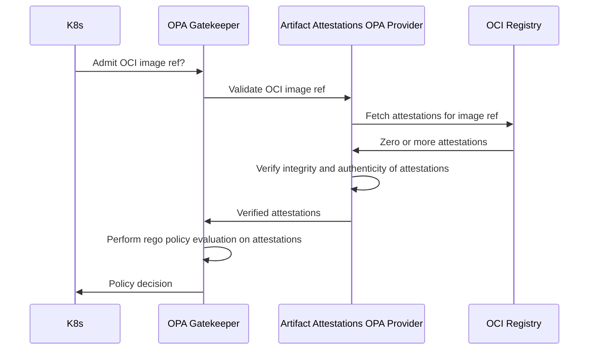

# GitHub Artifact Attestations OPA Provider

> [!CAUTION]
> This project is in an early preview state and contains experimental
> code. It is under active development and not ready for production
> use. Breaking changes are likely, and stability or security is not
> guaranteed. Use at your own risk.

This integrates [OPA Gatekeeper's ExternalData
feature](https://open-policy-agent.github.io/gatekeeper/website/docs/externaldata)
with [Artifact attestations](https://github.com/actions/attest) to
allow for policy evaluation based on image's signed SLSA build
provenance.

> [!IMPORTANT]
> For this to work, OPA Gatekeeper must run with
> `enableExternalData=true`, which can be configured during
> installation.

## Limitations

* mTLS between OPA Gatekeeper and the external data provider is not
  yet implemented, only server side TLS
* No offline mode exposed via the helm chart

## Networking

The Artifact Attestations OPA Provider needs to have network access
to:

* The OCI registry where the containers are stored, to be able to
  download the SLSA build provenance documents.
* `https://tuf-repo.github.com` to update and verify the trust root
  for GitHub's Sigstore instance.
* `https://tuf-repo-cdn.sigstore.dev` to update and verify the trust
  root for Sigstore's public good instance (this can be disabled with
  the `-no-public-good` flag)

## Installation

### Preparation

Before the installation starts, two steps are required to prepare:

1. How OPA Gatekeeper authenticates the OPA External Data
   Provider. This is done via regular TLS certificates, but they must
   be created and made available to the services.
1. If private OPI registries are used, the authentication must be
   configured.

#### OCI Authentication

Currently there are two tested authentication methods known to work
with private OCI registries:

1. Using `imagePullSecrets`
2. Using Managed Identities with Azure Managed Kubernetes Service
   (AKS)

Although these are the only tested authentication methods, others may
work (Azure using Sevice Principals, GKE and EKS configurations) as
long as the POD/Service Accounts are configured properly.

To use `imagePullSecrets`, prepare the secret in the namespace used by
the Artifact Attestations OPA Provider. The default name is
`aa-login-secret` but can be changed if needed, just make sure to
update the value in `values.yaml` before installing.

To use Azure Managed Identities, first configure the Managed Identity
with the required permission (ACR Pull against the relevant
registries), then [configure a federated
credential](https://learn.microsoft.com/en-us/entra/workload-id/workload-identity-federation-config-app-trust-managed-identity?tabs=microsoft-entra-admin-center#configure-a-federated-identity-credential-on-an-existing-application)
against the K8s cluster.

To enable the use of Azure Managed Identities, you must provide the
Managed Identity's Client ID: `--set azureClientId=${AZURE_CLIENT_ID}`
during helm install.

#### TLS certificates

> [!NOTE]
> Tested version of OPA Gatekeeper up to version 3.18.2 only supports
> RSA keys for the TLS certificates.

OPA Gatekeeper relies on TLS authentication when communicating with
external data providers. There is a provided
[script](scripts/gen_certs.sh) to generate a self signed CA and TLS
certificate. The certificate can be created via other means, as long
as the private key can be mounted as a secret to the Artifact
Attestations OPA Provider POD.

When installing the Artifacts Attestations OPA Provider, the CA
certificate bundle must be provided to configure the root of trust.

The secret containing the TLS certificate and private key can be
automatically created, or created separately from the helm
installation. The secret must have the name `provider-tls-cert`.

### Install via helm

#### Using `imagePullSecrets`

```
$ helm install artifact-attestations-opa-provider charts/artifact-attestations-opa-provider \
    --set provider.tls.caBundle="$(cat certs/ca.crt | base64 | tr -d '\n\r')" \
    --set serverCert="$(cat certs/tls.crt | base64 | tr -d '\n\r')" \
    --set serverKey="$(cat certs/tls.key | base64 | tr -d '\n\r')" \
    --set imagePullSecrets=<name-of-your-secret> \
    --namespace provider-system \
    --create-namespace
```

#### Using Azure Managed Identity

```
$ helm install artifact-attestations-opa-provider charts/artifact-attestations-opa-provider \
    --set provider.tls.caBundle="$(cat certs/ca.crt | base64 | tr -d '\n\r')" \
    --set serverCert="$(cat certs/tls.crt | base64 | tr -d '\n\r')" \
    --set serverKey="$(cat certs/tls.key | base64 | tr -d '\n\r')" \
    --set azureClientId=${AZURE_CLIENT_ID} \
    --namespace provider-system \
    --create-namespace
```

#### Using Azure Managed Identity and an existing TLS secret

```
$ helm install artifact-attestations-opa-provider charts/artifact-attestations-opa-provider \
    --set provider.tls.caBundle="$(cat certs/ca.crt | base64 | tr -d '\n\r')" \
    --set serverCert="" \
    --set azureClientId=${AZURE_CLIENT_ID} \
    --namespace provider-system \
    --create-namespace
```

## Verification

### Architecture

GitHub Artifact Attestations OPA provider is a regular [OPA Gatekeeper
external data
provider](https://open-policy-agent.github.io/gatekeeper/website/docs/externaldata).

It works by interacting with OCI registries to fetch [Sigstore
bundles](https://github.com/sigstore/architecture-docs/blob/main/client-spec.md#5-serialization-and-wire-format)
containing attestations for the container to be deployed. The Artifact
Attestations OPA provider will fetch the bundles, verify the
cryptographic integrity, and if valid, return them to OPA Gatekeeper,
where the data can be used during policy evaluation. This means only
the cryptographic properties are verified within the Artifact
Attestations OPA provider, the rego policy is evaluated by OPA
Gatekeeper with normal [constraint
objects](https://open-policy-agent.github.io/gatekeeper/website/docs/constrainttemplates). In
the constraint configuration is where affected resources and
namespaces are configured.

> [!NOTE]
> OPA Gatekeeper has a hard timeout on 3 seconds, which include the
> time for the external data provider. Be sure that you don't have
> unnecessary attestations stored in the OCI registry as it may impact
> the duration so that a timeout can occur.



### Rego policies

Three examples are provided that can be used as references when
building out the policy.

The policies are regular OPA Gatekeeper Constraints, where the
enforcement action can be set, and the targeted/ignored resources.

When writing the policy using the provided examples, the organization
should be the name of the GitHub org, like `octo-org`, and the
repository must include the org name like `octo-org/octo-repo`.

The following three examples are provided:

1. [Verify image](validation/from-org-constraint-template.yaml) is
   built from a list of provided organizations.
1. [Verify image](validation/from-repo-constraint-template.yaml) is
   built from a list of provided repositories.
1. [Verify
   image](validation/from-org-with-signer-constraint-template.yaml) is
   originating from a list of organizations, and built with a reusable
   workflow from a list of provided repositories.

The examples are also defined in [policies.rego](rego/policies.rego)
with tests, and example data. An example policy for working with a
custom attestation type is also provided.

Assuming the policy for verifying images originating from a specific
repository is updated to contain the expected repositories, apply
them to OPA Gatekeeper with the following command:

```
$ kubectl apply -f validation/from-repo-constraint-template.yaml
$ kubectl apply -f validation/from-repo-constraint.yaml
```

## Metrics

The GitHub Artifact Attestations OPA data provider provided Prometheus
metrics, exposed via `http` at `:9090/metrics`. The port can be
configured with the `-metrics-port` flag (`9090` is the default).

The metrics exposed beyond the default Prometheus metrics are:

* `aaop_attestations_retrieved_total`: the total number of
  attestations downloaded from the OCI registry.
* `aaop_attestations_retrieved_failed`: the total number of
  failed attestations downloaded from the OCI registry.
* `aaop_attestations_verified_ok`: the total number of verified
  attestations.
* `aaop_attestations_verified_failed`: the total number of
  attestations that failed to verify.
* `aaop_attestations_request_timer`: the duration in seconds for
  the validation webhook.
* `aaop_attestations_retrieved_timer`: the duration in seconds for the
   time it takes to download the attestations from the OCI registry.
* `aaop_attestations_verification_timer`: the duration in seconds for
  the time it takes to verify the retrieved attestations.

## Uninstall

```
$ kubectl delete -f validation
$ helm uninstall artifact-attestations-opa-provider -n provider-system
```

## License

This project is licensed under the terms of the MIT open source license. Please refer to the [LICENSE](./LICENSE.txt) for the full terms.